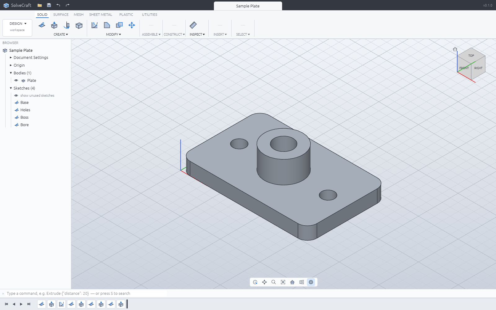

# SolveCraft

SolveCraft is an open-source parametric 3D CAD application written in Rust, in the style of
Autodesk Fusion: sketch on a plane, constrain and dimension the sketch, turn profiles into solids
with extrude and revolve, round edges, combine bodies, and change a parameter to watch the whole
timeline rebuild. It is a clean-room implementation (see [CLAUDE.md](CLAUDE.md)) and part of the
storytold "craft" family.



**Status: early (milestone M0 done, M1 in progress).** See [ROADMAP.md](ROADMAP.md),
[docs/parity.md](docs/parity.md) (command parity with Fusion's Design workspace) and
[docs/oracle.md](docs/oracle.md) (parts built in Fusion, rebuilt and measured in SolveCraft).

## What works

- **Sketches** on the origin planes, offset planes or planar faces: lines, rectangles (2-point,
  3-point, centre), circles (centre, 2-point, 3-point), arcs (3-point, centre), polygons, slots
  and points; construction geometry.
- **Constraints and dimensions** solved by our own solver (damped Gauss–Newton with
  degree-of-freedom analysis): coincident, horizontal/vertical, parallel, perpendicular, tangent,
  equal, concentric, collinear, midpoint, symmetry, fix; linear, aligned, horizontal, vertical,
  radius, diameter and angle dimensions driven by parameters. Over-constraining edits are
  rejected; fully constrained geometry turns black.
- **Profiles** found automatically, including regions split by lines and holes inside outlines.
- **Features** on a parametric timeline: extrude (one side, flipped, symmetric, two-sided, start
  offset; new body, join, cut, intersect), revolve, fillet and chamfer (straight convex edges),
  box, cylinder, sphere, torus, combine, move. The timeline rebuilds incrementally from the first
  changed feature; it can be rolled back, and features can be suppressed, renamed, edited and
  deleted.
- **Parameters** with unit-aware expressions (`2 * width + 5 mm`, `angle / 2`).
- **Files**: designs as JSON (`.solvecraft`), export to STEP (AP242 with body names, colours and
  components as assemblies; revolved faces as native planes, cylinders, cones, spheres and tori),
  IGES 5.3 (manifold solid B-reps with names and colours), 3MF, STL (binary/ASCII) and OBJ;
  3MF, STL and OBJ import as mesh bodies (they render, measure, move and export; solid features
  need B-rep bodies);
  STEP import (AP203/AP214/AP242 solids, assemblies, units, names, colours) and IGES import
  (manifold solid B-reps, or trimmed and bounded surfaces sewn into solids) as a base feature
  that later features build on — open a `.step`/`.stp`/`.igs`/`.iges` file, insert one into a
  design, or drop it on the window ([docs/step-import.md](docs/step-import.md)).
- **Desktop app** (egui + wgpu): toolbar with workspace tabs, browser, timeline, 3D viewport with
  view cube and navigation bar, sketch tools, feature dialogs, command palette, and a JSON-lines
  control channel so agents and tests can drive it.
- **Headless CLI** `solvecraft-cli`: run command scripts, measure (volume, area, centre of mass,
  face/edge/vertex counts), export, render PNG snapshots, replay Fusion oracle recipes.
- **MCP server** `solvecraft-cli mcp`: AI agents model, measure and look at parts headless or
  in the running app (see below).

## Build and run

```sh
cargo run --release -p solvecraft -- --sample          # desktop app with a sample part
cargo run --release -p solvecraft-cli -- commands      # the command registry
cargo run --release -p solvecraft-cli -- run examples/bracket.json --out bracket.step
cargo run --release -p solvecraft-cli -- snapshot examples/bracket.json --out bracket.png
cargo run --release -p solvecraft -- part.step          # open a STEP file as a new design
cargo run --release -p solvecraft-cli -- eval part.step # measure an imported STEP file
cargo xtask ci                                          # fmt, clippy, tests, assets, layers, wasm
```

Windows builds: `cargo xwin build --release --target x86_64-pc-windows-msvc -p solvecraft`.

In the browser: `cd apps/solvecraft-web && trunk build --release --public-url ./` (WebGPU, or
WebGL2 with `?webgl`; `?sample` opens the sample part).

## Scripts

A script is a JSON list of commands, the same ones the UI runs:

```json
{"commands": [
  {"command": "SketchCreate", "params": {"plane": "XY"}},
  {"command": "ShapeRectangleTwoPoint", "params": {"p0": [0, 0], "p1": [40, 30]}},
  {"command": "Extrude", "params": {"distance": 20}},
  {"command": "FusionFilletEdgesCommand", "params": {"edges": [[0, 0, 10]], "radius": 3}}
]}
```

## AI agents (MCP)

`solvecraft-cli mcp` is a [Model Context Protocol](https://modelcontextprotocol.io) server on
stdio. Headless it runs its own design session; with `--connect 127.0.0.1:PORT` it drives the app
started with `solvecraft --control PORT`, so you can watch the agent model. Tools:
`list_commands`, `execute`, `batch`, `inspect_design`, `measure`, `body_topology`,
`set_parameter`, `screenshot` (returns the image), `export`, `undo`, `redo`, `new_design`, `open`,
`save`. Claude Code: `claude mcp add solvecraft -- solvecraft-cli mcp`. Details, client
configuration and an example session: [docs/mcp.md](docs/mcp.md).

## Architecture

| Layer | Crates | Role |
|---|---|---|
| L0 | `geom` | vectors, planes, profiles, meshes and their measures |
| L1 | `sketch`, `kernel`, `render` | constraint solver and profiles; the B-rep kernel boundary (truck); view math and CPU rasterizer |
| L2 | `doc` | parameters, expressions, the feature timeline and its incremental evaluation |
| L3 | `io` | design files, STL/OBJ/STEP/3MF export, STEP and 3MF/STL import features |
| L4 | `engine` | the session and the command registry (everything is a command) |
| L5 | `ui-egui`, `mcp` | the swappable desktop front end; the MCP server (headless or bridged to the app) |
| apps | `solvecraft`, `solvecraft-cli` | desktop app, headless CLI |

## Licence

MIT OR Apache-2.0, at your option. SolveCraft is not affiliated with Autodesk; Fusion is a
trademark of Autodesk, Inc.
